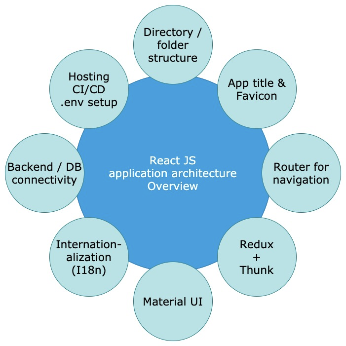

# Classificados ITA

## Descrição do Projeto

No ITA, alunos querem vender ou deixar de graça produtos para outros bixos, principalmente iteanos que estão se formando. Isso acontece, pois é necessário trocar ou deixar coisas para antes de sair do H8 e ter uma vida fora do ITA. Em outros casos, as pessoas querem apenas se desfazer de produtos de forma rápida e eficiente para poder ter outros.

A forma atual de se desfazer disso é usando grupos de WhatsApp e do grupo dos alunos do ITA no Facebook, no qual são feitas postagens de produtos e descrição. Contudo, há vários problemas na venda.

Uma maneira de solucionar o problema seria esse projeto, que é uma plataforma para que alunos do ITA possam comprar e vender produtos em um único lugar sem a preocupação de ter que buscar em um post antigo do Facebook ou Whatsapp e ter facilidade de contato tanto para quem vende quanto para quem compra.

## Arquitetura

A arquitetura do projeto é baseada no modelo da imagem abaixo. Esse modelo considera as distribuições de um projeto react completo e com as tecnologias integradas a ferramenta mais atualizadas possíveis. O design foi baseado na recomendação do [Post do Medium](https://medium.com/geekculture/react-js-architecture-features-folder-structure-design-pattern-70b7b9103f22).



## Instalação do Projeto

Antes de iniciar o projeto é importante executar o commando de instalaçao dos pacotes:

```sh
npm i
```

Para executar o projeto, basta executar o script:

```sh
npm start
```

O projeto será executado no modo de desenvolvimento. Para visualização, basta no link [http://localhost:3000](http://localhost:3000) com um browser.

## Testes

Os testes podem ser executados usando o comando:

```
npm test
```

Não foi realizado testes unitários para as páginas, mas para componentes que não dependiam do react. Informações sobre apadronização dos testes está contido na documentação [running tests](https://facebook.github.io/create-react-app/docs/running-tests).
